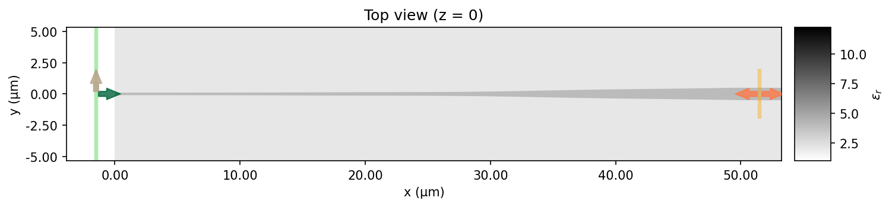
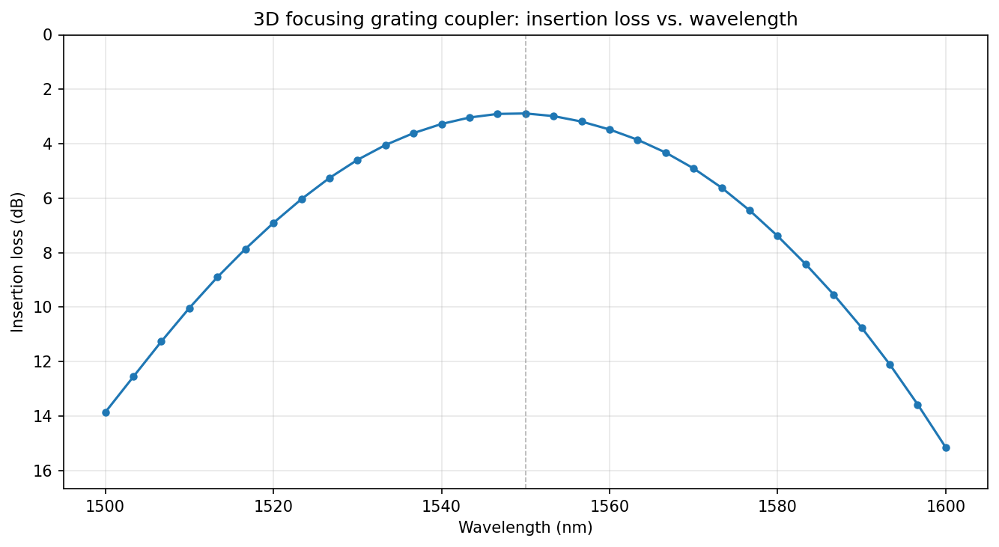
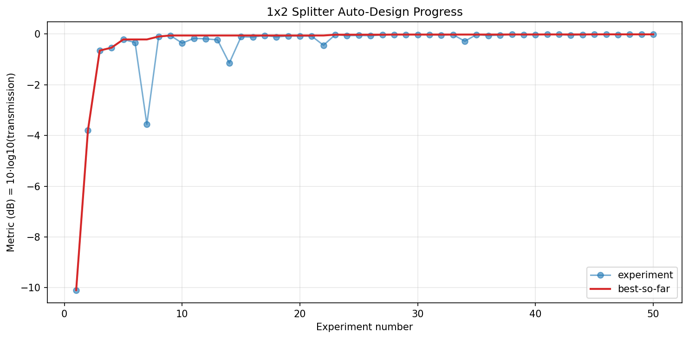

# Silicon Photonic 3D Focusing Grating Coupler — Design Showcase

> This branch showcases a single run of the auto-design agent on a compact
> silicon-photonic 3D focusing fiber-to-chip grating coupler. **See the
> [main branch](../../tree/main) for the project introduction, setup, and
> full description of the framework.**

The agent was first run in 2D (experiments 1–50) to find the
scalar tooth / period / angle parameters of a straight grating coupler
(best 2D metric 0.5420). Those parameters were then seeded into a
**3D focusing** geometry with confocal elliptical teeth, a 500 nm
silicon strip output waveguide, and a triangular fan taper connecting
the two. Over 20 more experiments (51–70) the agent tuned the new
3D-specific knobs (focal length, angular arc span, beam centering,
and — critically — the ellipse eccentricity) while re-checking that
the 2D-optimized knobs still held up under 3D physics.

## Final Result

**51.42 % peak coupling ≈ −2.89 dB insertion loss** at 1550 nm into
the fundamental TE mode of a 500 nm strip waveguide.
**46.7 nm 3-dB bandwidth** (1527–1573 nm) across the C-band.

### Geometry

Device stack (fixed): Si substrate / 2 µm BOX / 220 nm Si device
layer / 2 µm SiO₂ top cladding / air. The 70 nm partial etch defines
the grating teeth.

| Section | Extent | Description |
|---|---|---|
| Strip waveguide | 500 nm wide × 220 nm, x ≤ 0 | Fundamental TE output port (n_eff ≈ 2.4) |
| Fan taper | x ∈ [0, 12] µm, ±25° arc | Solid 220 nm Si; outer edge on tooth 0's inner arc |
| Un-etched slab | r ∈ [≈12, 30.5] µm, ±25° arc | 150 nm Si between teeth |
| Grating teeth | 25 confocal ellipses | 220 nm teeth, chirped radial period 0.733 → 0.749 µm, uniform DC = 0.40 |
| Source | Gaussian beam, 5.2 µm waist | Tilted 34° from vertical, centered above r ≈ 19.6 µm |

Each tooth is a confocal elliptical arc
`r(φ) = r₀·(1−e)/(1−e·cos φ)` with one focus at the waveguide tip.
The eccentricity `e = sin(θ)/n_eff` was tuned empirically to
`e ≈ 0.14` (i.e. `n_eff ≈ 4.0` in the formula) — much flatter than
the plane-wave grating equation predicts with the slab's n_eff ≈ 2.65.
This was the single biggest 3D-specific gain.

### Insertion Loss vs. Wavelength

Broadband sweep over 31 points from 1500 to 1600 nm (single FDTD run).
The passband is centered at 1550 nm as designed, with ~3 dB insertion
loss across the 1527–1573 nm window. Edge-of-band coupling at 1500 nm
and 1600 nm drops to ~15 dB due to the phase-matching condition
drifting away from the grating equation.

## Optimization Progress

The dashed vertical line at experiment 51 marks the switch from a 2D
slab grating to the 3D focusing geometry. The two phases are scored
against *different* devices, so they track separate running-best
lines (blue for 2D, purple for 3D).

**Phase 1–3: 2D slab grating (exp 1–50, best 0.5420)**

- Exp 1–9 (0.24 → 0.36): coarse period/angle sweeps. Matching the
  grating equation `Λ = λ/(n_eff − sin θ)` across angles of 10 →
  22 → 26° gives monotonic improvement. Angle 26° plateaus.
- Exp 10–18 (0.36 → 0.52): monotonic DC apodization (0.25 → 0.5)
  together with angle retuning to 34° — the largest single jump.
- Exp 19–50 (plateau at 0.54): fine-tuning DC range, beam centering,
  and a small reversed period chirp 0.733 → 0.749 µm.

**Phase 4: 3D focusing grating coupler (exp 51–70, best 0.5142)**

- Exp 51 (0.4943): 3D baseline with every 2D-optimized knob seeded
  directly, plus focal_length = 12 µm, ±25° arc, and the
  analytically-derived ellipse eccentricity `e = sin(34°)/2.65 ≈ 0.21`.
  About 5 pp below the 2D best — the expected focusing cost.
- Exp 52–61 (plateau ≈ 0.4943): 3D-specific knob re-tuning (focal
  length, arc angle, beam shift, apodization, chirp, incident angle).
  Every sweep landed on the 2D-seeded value — the 2D lessons
  transferred almost verbatim. Notable exception: the 3D angle peak
  is *sharper* than in 2D (±2° drops metric by ~7 pp).
- Exp 62–69 (0.4943 → 0.5142): ellipse-eccentricity sweep via the
  `n_eff_est` knob. Flattening the ellipses beyond what the grating
  equation predicts (`n_eff_est` 2.65 → 3.8–4.0, i.e. e 0.21 → 0.14)
  yielded +0.02 — the only substantial 3D-specific gain. Likely
  explanation: the focused slab mode has non-plane-wave spatial
  curvature that shifts the phase-matching condition across the arc;
  the plane-wave grating equation is no longer exact.

Full reasoning and discarded experiments are in
[output/journal.md](output/journal.md); raw metrics in
[output/results.tsv](output/results.tsv). The 2D campaign (exp 1–50,
best 0.5420) is logged in the same files.

## Files of Interest

- [design.py](design.py) — final device geometry
- [output/best_design.py](output/best_design.py) — snapshot of the best design (broadband mode monitor enabled)
- [broadband.py](broadband.py) — broadband sweep + IL plot runner
- [output/journal.md](output/journal.md) — experiment-by-experiment reasoning
- [output/results.tsv](output/results.tsv) — raw metrics log
- [output/preview.png](output/preview.png), [output/insertion_loss.png](output/insertion_loss.png), [output/progress.png](output/progress.png)
