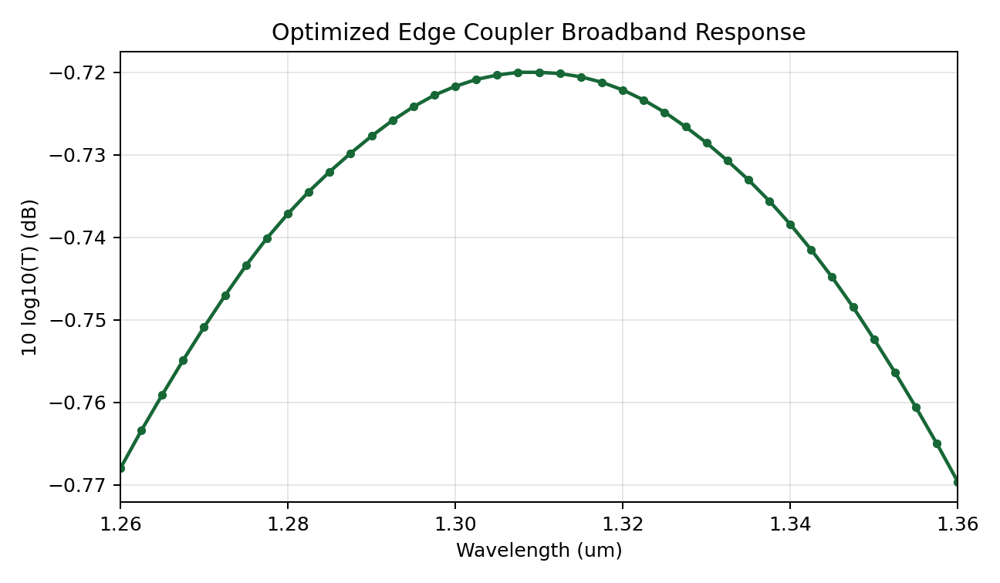

# SiN Edge Coupler - Design Showcase

> This branch showcases a run of the auto-design agent on a 1310 nm
> silicon-nitride edge coupler for a 3.2 um MFD Gaussian input beam.
> **See the [main branch](../../tree/main) for the project introduction,
> setup, and full description of the framework.**

The agent started from a simple linear inverse taper and optimized coupling
from free space into the fundamental TE mode of a 1 um wide, 400 nm thick SiN
waveguide. The device was constrained to a fixed 50 um taper length, a chip
facet at x = 0, y symmetry, and a 150 nm minimum feature size.

Across 10 logged experiments, plus broadband and parameter-sweep simulations,
the design evolved from a plain 180 nm linear inverse taper to a smooth
single-solid taper with localized profile corrections that delay mode
compression through the middle of the device and recover width near the output.

## Final Result

**84.72% coupling efficiency = -0.72 dB insertion loss** at 1310 nm.

The optimized design also stays flat across the O-band sweep that was run:
from **-0.768 dB at 1260 nm** to **-0.770 dB at 1360 nm**, with a best point
of **-0.720 dB near 1308-1310 nm**.

## Geometry


Layout:

| Section | x-range (um) | Description |
|---|---:|---|
| Facet tip | 0.00 | 200 nm SiN inverse-taper tip at the chip facet |
| Corrected taper | 0.00 - 50.00 | Smooth nonlinear taper from 200 nm to 1.0 um |
| Output guide | 50.00+ | Straight 1.0 um wide SiN waveguide |

The final taper width is generated from a normalized profile:

```text
w(x) = 0.20 um + 0.80 um * s(x)
```

where `s(x)` is a power-law taper (`power = 2.20`) multiplied by three smooth
Gaussian corrections:

| Correction | Center x/L | Width | Amplitude | Effect |
|---|---:|---:|---:|---|
| Early | 0.20 | 0.10 | -0.15 | Slightly delays initial width growth |
| Mid | 0.52 | 0.18 | -0.46 | Delays main mode compression |
| Late | 0.72 | 0.14 | +0.18 | Recovers width before the output guide |

This single-piece solid taper passed the automated 150 nm DRC. Trident side
rails and SWG front sections were explored, but both scattered more power than
the smooth solid taper for this 400 nm SiN stack and 50 um length.

## Field Distribution


The field is captured at the facet, remains centered through the taper, and
compresses smoothly into the 1 um output waveguide with low visible lateral
radiation.

## Broadband Response



Broadband data are in
[output/broadband_insertion_loss.tsv](output/broadband_insertion_loss.tsv).
The plotted quantity is `10log10(T)`, so more negative values mean larger
loss.

## Optimization Progress


The baseline linear taper started at **74.78% coupling**. The largest gain came
from replacing the linear taper with a slow-start nonlinear taper; later gains
came from localized profile corrections and retuning the tip width under the
corrected profile.

Full reasoning and discarded explorations are in
[output/journal.md](output/journal.md); raw metrics are in
[output/results.tsv](output/results.tsv).

## Files of Interest

- [design.py](design.py) - final device geometry
- [output/best_design.py](output/best_design.py) - snapshot of the best design
- [output/principles.md](output/principles.md) - literature/design principles
- [output/journal.md](output/journal.md) - experiment-by-experiment reasoning
- [output/results.tsv](output/results.tsv) - raw logged experiment metrics
- [output/preview.png](output/preview.png) - final geometry preview
- [output/field.png](output/field.png) - final field distribution
- [output/progress.png](output/progress.png) - optimization progress plot
- [output/broadband_insertion_loss.png](output/broadband_insertion_loss.png) - broadband response plot
- [output/broadband_insertion_loss.tsv](output/broadband_insertion_loss.tsv) - broadband response data
