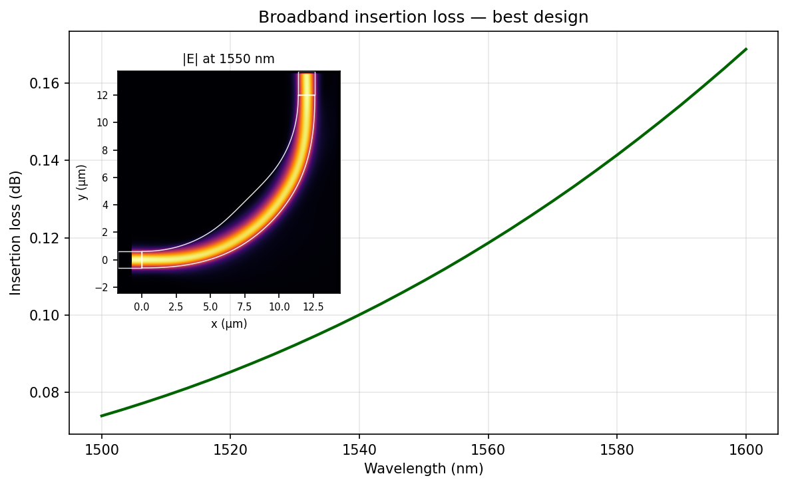

# Low-Loss 90° SiN Waveguide Bend — Design Showcase

> This branch showcases a single run of the auto-design agent on a 90°
> silicon-nitride waveguide bend at a fixed 12 µm bend radius.
> **See the [main branch](../../tree/main) for the project introduction,
> setup, and full description of the framework.**

The agent was given a blank slate (a plain circular arc baseline) and
asked to maximize single-mode transmission at 1550 nm for a SiN
1.2 × 0.4 µm waveguide bending through 90° at R = 12 µm, with a 150 nm
minimum feature size. Over 50 experiments it iterated through bend
families (circular, Euler / clothoid-arc-clothoid), width tapers, and
centerline offsets, converging on an Euler base with a widened middle
and an inward-bowed centerline.

## Final Result

**97.51 % mode transmission ≈ 0.109 dB insertion loss** at 1550 nm
(baseline circular bend: 89.96 %, ~0.46 dB).

### Geometry

Bend parameters (connects (0, 0) → (12, 12)):

| Parameter | Value | Role |
|---|---|---|
| `p_euler` | 0.45 | clothoid-arc-clothoid mix (45 % of 90° is clothoid) |
| `w_ratio` | 2.0 | peak width multiplier (1.2 µm → 2.4 µm at midpoint) |
| `r_offset` | −1.1 µm | peak inward centerline shift at midpoint |
| width / offset profile | sin²(π u) | zero value **and** zero derivative at endpoints |

Three cooperative techniques stack to give the final design:

1. **Euler (clothoid-arc-clothoid) base** — curvature-continuous entry
   and exit eliminate the abrupt K-step of a pure circular bend, killing
   junction mode-mismatch (+3 %).
2. **sin² symmetric width taper** — widens the middle of the bend to
   2.4 µm, boosting bent-mode confinement; smoothly returns to 1.2 µm at
   the junctions (+0.3 %).
3. **sin² inward radial offset** — bows the centerline toward the bend
   center, relaxing the average effective curvature of the path and
   aligning the waveguide with the widened bent-mode centroid (+4 %).

The sin²(π u) profile is essential — its zero derivative at u = 0 and
u = 1 prevents kinks that would reintroduce reflection. Non-smooth
profiles (sin¹, sin⁴) collapsed transmission below 70 %.

### Field Distribution

The mode cleanly tracks the outer wall of the widened middle section
with very little radiation on the inner sidewall and minimal ripple in
the horizontal input, consistent with the 0.11 dB loss.

### Broadband Performance

Monotonic rise from 0.074 dB at 1500 nm to 0.169 dB at 1600 nm — less
than 0.1 dB variation across the full C-band.

## Optimization Progress

Discarded runs (red ×) visible across the whole sweep — including the
sin¹/sin⁴ profile-shape probes late in the run that established
sin²(π u) as the optimal window. The two big steps in best-so-far come
from (i) adopting the Euler base (exp 2) and (ii) discovering the
inward-offset technique (exp 18–21).

Full reasoning and discarded experiments are in
[output/journal.md](output/journal.md); raw metrics in
[output/results.tsv](output/results.tsv).

## Files of Interest

- [design.py](design.py) — final device geometry
- [output/best_design.py](output/best_design.py) — snapshot of the best design
- [output/journal.md](output/journal.md) — experiment-by-experiment reasoning
- [output/results.tsv](output/results.tsv) — raw metrics log
- [output/broadband.py](output/broadband.py) — broadband IL sweep script
- [output/progress.py](output/progress.py) — progress-plot script
- [output/preview.png](output/preview.png), [output/field.png](output/field.png), [output/broadband_IL.png](output/broadband_IL.png), [output/progress.png](output/progress.png)
