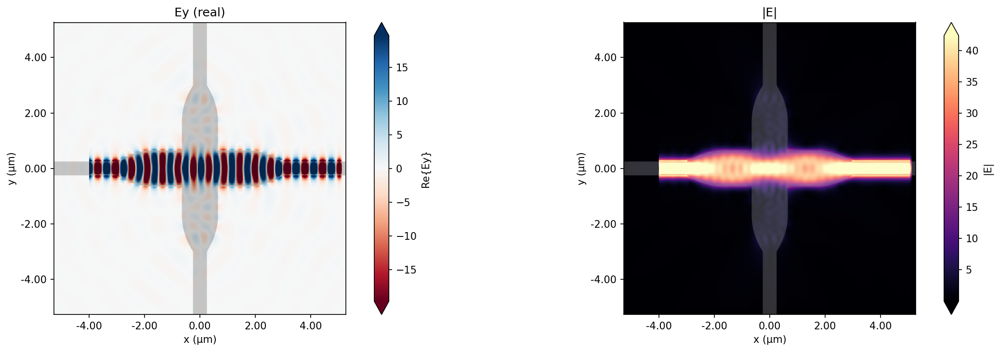

# Silicon Photonic Waveguide Crossing — Design Showcase

> This branch showcases a single run of the auto-design agent on a compact
> silicon-photonic broadband waveguide crossing. **See the
> [main branch](../../tree/main) for the project introduction, setup, and
> full description of the framework.**

The agent was given a simple linear dual-taper baseline and asked to
maximize mean mode transmission (west → east) over 1.5–1.6 µm within a
6 × 6 µm design region, with 150 nm minimum feature size and 4-fold
crossing symmetry (identical horizontal and vertical arms). Over 50
experiments it iterated through taper profiles, MMI parameters, and
topology variations, converging on a symmetric MMI-based crossing with
parabolic access tapers.

## Final Result

**97.47 % mean transmission ≈ −0.11 dB insertion loss** across 1.5–1.6 µm.

### Geometry

Two orthogonal identical arms intersecting at the origin:

| Section | Extent (µm) | Description |
|---|---|---|
| Feed tapers | outer 1.3 µm of each arm | Parabolic (t²), 500 nm → 1.30 µm |
| MMI flat section | inner 3.4 µm of each arm | Constant 1.30 µm wide |
| Central overlap | 1.30 × 1.30 µm square | Union of H and V MMI sections |

Each arm parabolically widens from the 500 nm feed waveguide to a
1.30 µm multimode section over 1.3 µm, then stays flat through the
center. The parabolic profile has zero slope at the MMI boundary
(smooth transition into the multimode region) and a finite slope at the
feed junction (matched to the single-mode waveguide). The two orthogonal
MMIs cross in a central "plus-sign" region whose self-imaging behavior
recollimates the mode onto the output port.

### Field Distribution

Single-image propagation through the horizontal MMI with faint residual
leakage into the perpendicular arms — the main loss mechanism remaining
in the symmetric design.

## Optimization Progress

The trajectory runs through four phases:

- **Exp 1–6 (0.81 → 0.87):** baseline linear dual-taper, then smooth
  parabolic profile, then center-width sweep (peak at 1.4 µm).
- **Exp 7–10 (0.87 → 0.93):** topology change to MMI with a flat
  central section — large jump from self-imaging over a constant-width
  region.
- **Exp 11–35 (0.93 → 0.97):** parameter refinement — taper-profile
  studies (linear / cubic / exponential / cosine all worse than
  parabolic), edge fillets (discarded), and a 2D sweep of MMI width vs.
  length, converging on w = 1.30 µm, flat half-length = 1.7 µm.
- **Exp 51–60 (plateau at 0.9747):** extended runs under the 4-fold
  symmetry constraint. Fine parameter sweeps, corner fillers, a
  central SiO₂ etch, a central Si hub, and smoothstep / pure-parabolic
  taper profiles — none beat the plateau. The optimum is a broad flat
  region around (w=1.30, mmi_half=1.70).

> An exploratory branch (exp 36–50, shown in orange on the plot)
> deliberately broke the H / V arm symmetry and reached 0.9896, but
> that design does not form a valid reciprocal 4-port crossing and is
> excluded from the symmetric running-best.

Full reasoning and discarded experiments are in
[output/journal.md](output/journal.md); raw metrics in
[output/results.tsv](output/results.tsv).

## Files of Interest

- [design.py](design.py) — final device geometry
- [output/best_design.py](output/best_design.py) — snapshot of the best design
- [output/journal.md](output/journal.md) — experiment-by-experiment reasoning
- [output/results.tsv](output/results.tsv) — raw metrics log
- [output/preview.png](output/preview.png), [output/field.png](output/field.png), [output/progress.png](output/progress.png)
