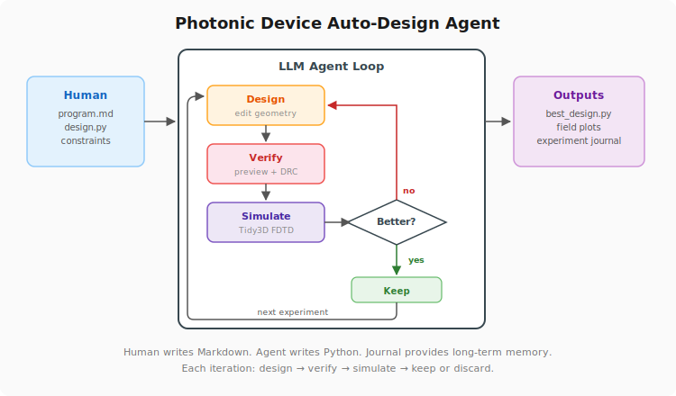

# Photonic Device Auto-Design Agent

An autonomous photonic device design agent, inspired by Andrej Karpathy's
[autoresearch](https://github.com/karpathy/autoresearch). Instead of a human
manually tuning device geometry and running simulations, an LLM agent
(e.g. Claude Code) takes over the design loop: it reads instructions and
constraints from a Markdown file, modifies the device geometry in Python,
visually verifies the layout, runs a fabrication design-rule check, submits
FDTD simulations to Tidy3D's cloud solver, inspects the resulting field
patterns, and decides whether to keep or discard each design — all without
human intervention.



## How It Works

Before the loop, the agent does a one-time **literature review** of the
target device class — common topologies, underlying physics, state-of-the-art
metrics — and captures it in `output/principles.md` as a stable design
reference.

Each iteration then runs through a fixed loop:

```
Explore → Design → Verify (DRC + preview) → Simulate → Log (keep/discard)
```

Long-term memory spans two files: `output/principles.md` holds the literature
review, and `output/journal.md` logs each experiment's hypothesis and lesson.
Together they let the agent learn from both successes and failures and avoid
repeating dead ends. The human's job is to define the problem (device type,
constraints, target metric) in `program.md`; the agent does the engineering.

## Example Designs

See a few examples of what the AI photonic designer has designed:

- [`1x2splitter`](../../tree/1x2splitter)
- [`taper`](../../tree/taper)
- [`crossing`](../../tree/crossing)


## Project Structure

| File | Role |
|------|------|
| `program.md` | Agent instructions, constraints, loop rules |
| `design.py` | Device geometry (the only file the agent modifies) |
| `simulate.py` | Runs Tidy3D FDTD simulation, extracts metric, plots fields |
| `preview.py` | Generates geometry preview for visual inspection |
| `drc.py` | Fabrication rule check via KLayout |
| `orchestrate.py` | Post-simulation bookkeeping: parses run log, updates TSV/journal, handles keep/discard |
| `output/` | All generated files (principles, logs, plots, journal, best design) |

## Setup

```bash
pip install tidy3d numpy matplotlib klayout
tidy3d configure --apikey=YOUR_API_KEY
```

Get your Tidy3D API key at [tidy3d.simulation.cloud](https://tidy3d.simulation.cloud).

## Running

Point Claude Code (or any compatible LLM agent with shell + Python
execution) at `program.md`:

```bash
claude "Follow the instructions in program.md and start designing!"
```

The agent will run the loop for the number of experiments specified in
`program.md` (default: 50). Watch progress in `output/journal.md` and
`output/results.tsv`.

## Customizing for a Different Device

To adapt this framework to a new photonic device:

1. Edit `program.md` — describe the target device, metric, and constraints.
2. Edit `design.py` — update the initial geometry and the `evaluate()`
   function that computes the target metric from simulation data.
3. The rest of the infrastructure (`simulate.py`, `preview.py`, `drc.py`,
   `orchestrate.py`) is device-agnostic and does not need to change.

## Credits

Inspired by [karpathy/autoresearch](https://github.com/karpathy/autoresearch).
Built on [Tidy3D](https://www.flexcompute.com/tidy3d/) for FDTD simulation
and [KLayout](https://www.klayout.de/) for DRC.
